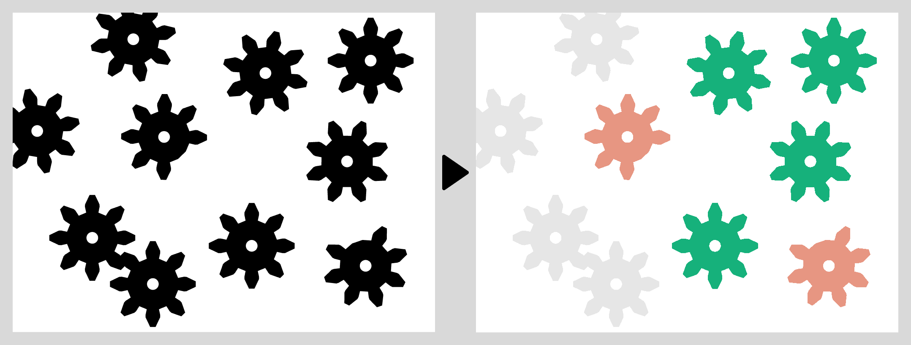

# Trabalho Final de Processamento Digital de Imagem

    

## Índice
1. [Sobre](#sobre)  
2. [Como foi implementado](#como-foi-implementado)  
    1. [Binarização](##binarização)
    2. [Remoção de objetos nas bordas](#remoção-de-objetos-nas-bordas)
    3. Segmentação
    4. Esqueleto
    5. Remoção de engrenagens juntas
    6. Avaliação de engrenagens defeituosas
3. Resultados
4. [Autores](#Autores)

## Sobre
Este repositório contém o trabalho final da disciplina de Processamento Digital de Imagens, do curso de Ciêncida da Computação da UFPI. A disciplina foi ministrada pelo professor Kelson Aires no período 2022.1. 

O trabalho final consistiu em analisar uma imagem com desenhos de engrenagens em uma esteira de produção e propor um sistema de clssificação. As engrenagens poderiam surgir em qualquer orientação, podendo apresentar ou não defeitos (algumas engrenagens teriam menos dentes que outras). O sistema deveria diferenciar as engrenagens que possuem defeito das que não possuem. Para facilitar o processo, as engrenagens que tocam as bordas da imagem e as que tocam umas nas outras não precisam ser analisadas e devem ser marcadas como "indeifindas"

Desafio: Implementação de um sistema que funcione para diversos tipos de engrenagens, não só as mostradas na imagem padrão do trabalho.

Imagem padrão disponibilizada pelo professor:

    

## Como foi implementado
### Binarização
### Remoção de objetos nas bordas
### Segmentação
### Esqueleto
### Remoção de engrenagens juntas
### Avaliação dos dentes das engrenagens
## Resultados
## Autores